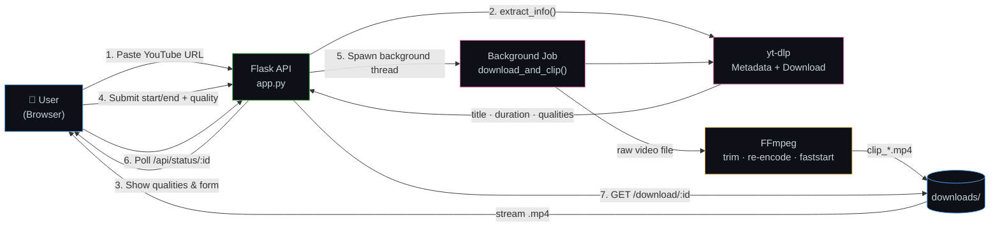
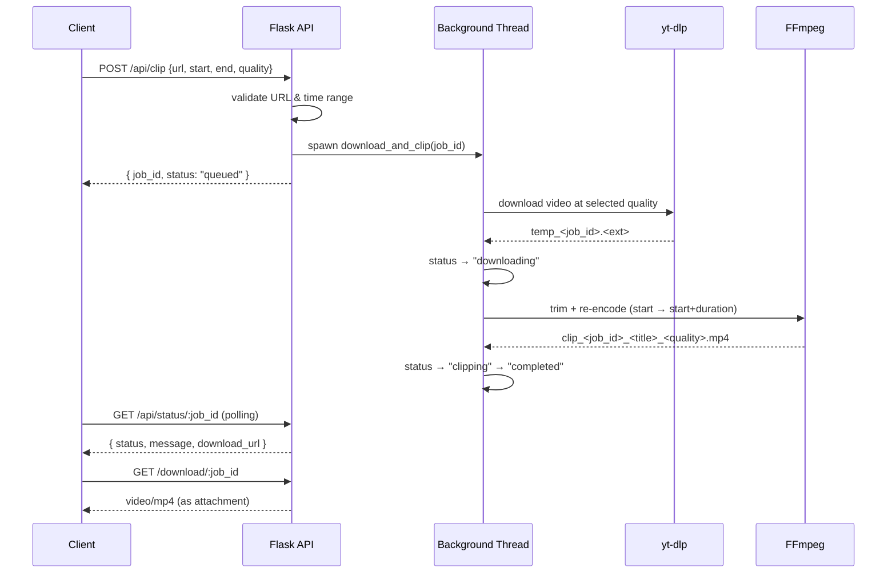

<div align="center">

# 🎬 yt-clipper

### Cobalt-Style YouTube Video Downloader & Clipper

A Flask web app that fetches a YouTube video, lets you pick a quality and an exact time range, and hands back a clean, streamable `.mp4` clip — powered by `yt-dlp` and `ffmpeg`, with async background job processing.

[](https://www.python.org/)
[](https://flask.palletsprojects.com/)
[](https://github.com/yt-dlp/yt-dlp)
[](#license)

**[🚀 Live Demo](https://yt-clipper-delta.vercel.app)**

</div>

---

## 📖 Overview

**yt-clipper** takes a YouTube URL, inspects it with `yt-dlp` to discover the available resolutions, and lets a user cut out a precise segment — start time to end time — without downloading the entire video by hand. Once a request is submitted, the clip is processed **asynchronously in a background thread**, so the UI can poll for status (`queued → downloading → clipping → completed`) while `ffmpeg` handles the actual trim and re-encode. Finished clips are served as direct, attachment-ready downloads, and stale jobs/files are swept up automatically after an hour.

---

## ✨ Features

| Capability | Description |
|---|---|
| 🔍 **Video Inspection** | Fetches title, duration, thumbnail, uploader, and view count via `yt-dlp` before any download starts |
| 🎚️ **Quality Selection** | Auto-detects every available resolution (360p → 4K) and lets the user pick one |
| ✂️ **Precise Time-Range Clipping** | Accepts `HH:MM:SS`, `MM:SS`, or plain seconds; validates the range against real video duration |
| ⚙️ **Async Job Pipeline** | Each request runs in its own background thread with live, pollable status updates |
| 🎞️ **FFmpeg Re-Encoding** | Re-encodes with `libx264`/`aac`, `-movflags +faststart` for instant streaming playback |
| 🧹 **Self-Cleaning Storage** | Background scheduler purges jobs and files older than 1 hour, every 30 minutes |
| 🛡️ **Guardrails** | Rejects non-YouTube URLs, invalid ranges, and clips longer than 10 minutes |
| 💾 **In-Memory Caching** | Repeated lookups of the same video reuse cached metadata instead of re-fetching |

---

## 🏗️ Architecture



---

## 🔄 Job Lifecycle

Every clip request is processed off the request thread, so the API responds instantly with a `job_id` while the real work happens in the background:



---

## 🚀 Getting Started

### Prerequisites

- **Python 3.9+**
- **FFmpeg** installed and available on your system `PATH` ([download](https://ffmpeg.org/download.html))

### Installation

```bash
git clone https://github.com/Ankith34/yt-clipper.git
cd yt-clipper
pip install -r requirements.txt
```

### Run Locally

```bash
python app.py
```

The app starts on **http://127.0.0.1:5000** and prints startup diagnostics — confirming Flask, Flask-CORS, `yt-dlp`, and `ffmpeg` are all available before it accepts requests.

---

## 🔌 API Reference

| Method | Endpoint | Description |
|---|---|---|
| `GET` | `/` | Main clipping UI |
| `POST` | `/api/video-info` | Fetch title, duration, thumbnail & available qualities for a URL |
| `POST` | `/api/clip` | Queue a new clip job — returns a `job_id` and `preview_url` |
| `GET` | `/api/status/<job_id>` | Poll current job status (`queued` / `downloading` / `clipping` / `completed` / `error`) |
| `GET` | `/download/<job_id>` | Download the finished `.mp4` once `status` is `completed` |
| `GET` | `/preview/<job_id>` | Status/preview page for a given job |
| `GET` | `/api/health` | Health check — active and total job counts |

**Example — request a clip**

```bash
curl -X POST http://127.0.0.1:5000/api/clip \
  -H "Content-Type: application/json" \
  -d '{
        "url": "https://www.youtube.com/watch?v=dQw4w9WgXcQ",
        "start_time": "00:00:10",
        "end_time": "00:00:40",
        "quality": "1080p"
      }'
```

```json
{
  "job_id": "b3f1c2a4-...",
  "preview_url": "/preview/b3f1c2a4-...",
  "status": "queued"
}
```

---

## 🛠️ Tech Stack

<div align="left">


</div>

| Dependency | Version |
|---|---|
| Flask | `2.3.3` |
| Flask-CORS | `4.0.0` |
| yt-dlp | `2023.7.6` |
| FFmpeg | External binary (required on `PATH`) |

---

## ⚠️ Guardrails & Limits

- Only accepts URLs from `youtube.com` / `youtu.be`
- Clip duration capped at **10 minutes** per request
- Start/end times validated against the real video duration before download begins
- Jobs and their files are automatically purged **1 hour** after creation

---

## 📁 Project Structure

```
yt-clipper/
├── app.py               # Flask app — video info, job queue, clipping, downloads
├── requirements.txt      # Flask, Flask-CORS, yt-dlp
├── docs/                 # Project documentation
└── templates/            # index.html (form) & preview.html (job status) — served by Flask
```

---

## 🗺️ Roadmap

- [ ] Persistent job storage (Redis/SQLite) instead of in-memory dict
- [ ] Progress percentage during download, not just phase labels
- [ ] Playlist / batch clipping support
- [ ] Dockerfile for one-command deployment

---

## 🤝 Contributing

Issues and pull requests are welcome. For significant changes, please open an issue first to discuss what you'd like to change.

## 📄 License

Licensed under the **MIT License** — see the [LICENSE](LICENSE) file for details.

---

<div align="center">

**Built by [Ankith](https://github.com/Ankith34)**

[](https://github.com/Ankith34)
[](https://linkedin.com/in/ankithkumarprofile)

</div>
